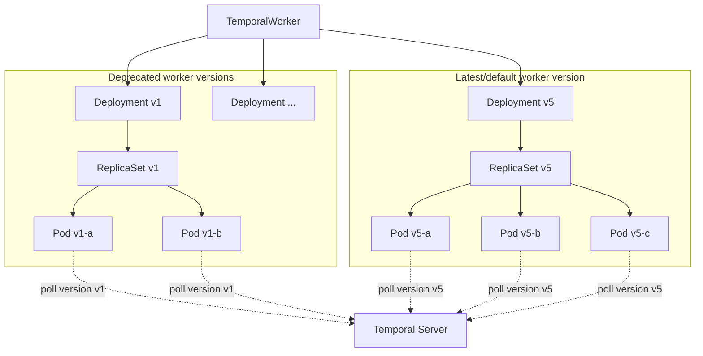
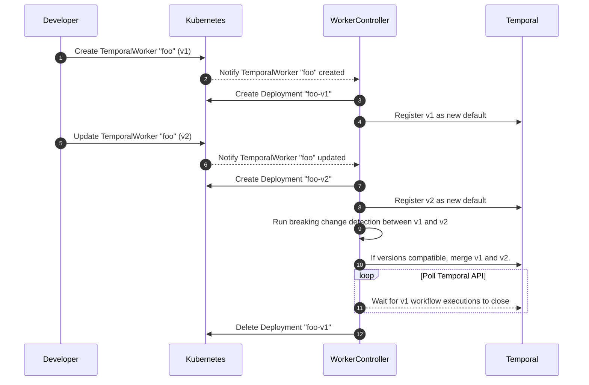

# Temporal Worker Controller

> ⚠️ This project is 100% experimental. Please do not attempt to install the controller in any production and/or shared environment.

The goal of the Temporal Worker Controller is to make it easy to run workers on Kubernetes while leveraging
[Worker Versioning](https://docs.temporal.io/workers#worker-versioning).

## Why

Temporal's [deterministic constraints](https://docs.temporal.io/workflows#deterministic-constraints) can cause headaches
when rolling out or rolling back workflow code changes.

The traditional approach to workflow determinism is to gate new behavior behind
[versioning checks](https://docs.temporal.io/workflows#workflow-versioning). Over time these checks can become a
source of technical debt, as safely removing them from a codebase is a careful process that often involves querying all
running workflows.

Worker Versioning is an alternative approach which enables
workflow executions to be sticky to workers running a specific code revision. This allows a workflow author
to omit version checks in code and instead run multiple versions of their worker in parallel, relying on Temporal to
keep workflow executions pinned to workers running compatible code.

This project aims to provide automation which simplifies the bookkeeping around tracking which worker versions still
have active workflows, managing the lifecycle of versioned worker deployments, and calling Temporal APIs to update the
default version after a deployment.

## Features

- [x] Registration of new worker versions
- [x] Creation of versioned worker deployment resources
- [x] Deletion of unreachable worker deployments
- [x] Manual, Blue/Green, and Progressive rollouts of new worker versions
- [ ] Autoscaling of worker deployments
- [ ] Automated rollover to compatible worker versions
- [ ] Canary analysis of new worker versions
- [ ] Optional cancellation after timeout for workflows on old versions
- [ ] Passing `ContinueAsNew` signal to workflows on old versions

## Usage

In order to be compatible with this controller, workers need to be configured using these standard environment
variables:

- `WORKER_BUILD_ID`
- `TEMPORAL_HOST_PORT`
- `TEMPORAL_TASK_QUEUE`
- `TEMPORAL_NAMESPACE`

Each of these will be automatically set in the pod template's env, and do not need to be manually specified outside the
`TemporalWorker` spec.

## How It Works

Every `TemporalWorker` resource manages one or more standard `Deployment` resources. Each deployment manages pods
which in turn poll Temporal for tasks pinned to their respective versions.

### Worker Lifecycle

When a new worker version is deployed, the worker controller automates the registration of a new default worker
version in Temporal.

As older workflows finish executing and deprecated worker versions are no longer needed, the worker controller also
frees up resources by deleting old deployments.

## Contributing

This project is in very early stages; as such external code contributions are not yet being solicited.

Bug reports and feature requests are welcome! Please [file an issue](https://github.com/jlegrone/worker-controller/issues/new).

You may also reach out to `@jlegrone` on the [Temporal Slack](https://t.mp/slack) if you have questions, suggestions, or are
interested in making other contributions.
